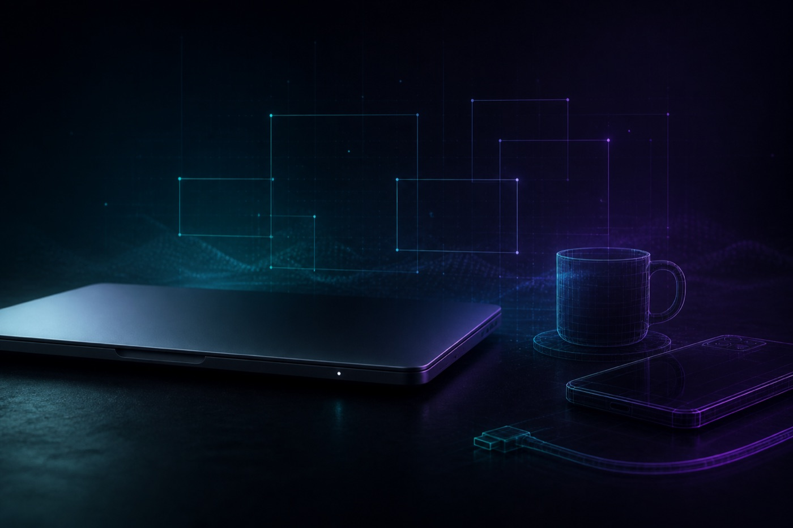
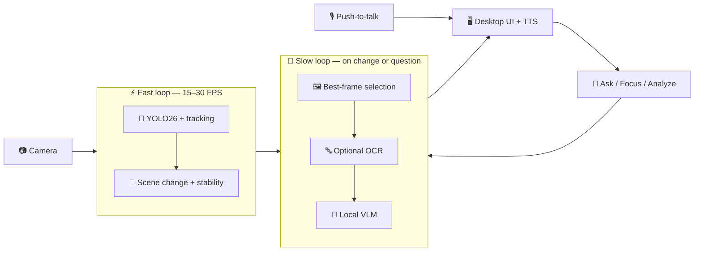

<p align="center">
  
</p>

<h1 align="center">Senti</h1>

<p align="center">
  <b>What Am I Looking At?</b><br>
  A local-first visual assistant for macOS — it sees the scene, names the objects, and answers your questions. On your Mac. Nothing uploaded.
</p>

<p align="center">
  <a href="LICENSE"></a>
  <a href="https://www.python.org/downloads/"></a>
  <a href="https://www.apple.com/mac/"></a>
  <a href="#privacy"></a>
  <a href="https://docs.pytest.org/"></a>
</p>

<p align="center">
  <a href="#quick-start"><strong>Quick start</strong></a> ·
  <a href="#how-it-works"><strong>How it works</strong></a> ·
  <a href="#stack"><strong>Stack</strong></a> ·
  <a href="docs/README.md"><strong>Docs</strong></a> ·
  <a href="#license"><strong>License</strong></a>
</p>

<p align="center">
  
</p>

## ✨ Why Senti

Most visual assistants ship camera frames to a cloud API. **Senti does not.**

It is built for Apple Silicon so the fast path — object detection and tracking — stays at interactive rates, while the slow path — a local vision-language model via [Ollama](https://ollama.com) — only runs when the scene actually changes or you ask a question.

| 🎯 Live boxes & track IDs | 💬 Follow-up questions | 🔍 Object focus |
| :---: | :---: | :---: |
| YOLO26 labels, confidence, stable `#1` `#2` IDs | *“What’s that connector?”* *“What objects do you see?”* | Crop `#2 phone` before the VLM sees it |
| 📝 On-device OCR | 🔊 Spoken answers | 🎙️ Push-to-talk |
| Ask `read this` or auto-read on `READY` | macOS TTS (Qt or `say`) | Local Whisper, **Esc** to cancel |

## 🚀 Features

| | Capability | Detail |
| :---: | --- | --- |
| 🎥 | **Live perception** | YOLO26 on Apple Silicon — PyTorch `mps` or yolo-mlx Metal — plus ByteTrack / BoT-SORT IDs |
| 🧭 | **Scene intelligence** | Visual + object + spatial change detection, stability gating, best-frame selection |
| 🧠 | **Local understanding** | Ollama VLM, auto-analysis when the scene settles, conversational memory |
| ✂️ | **Object focus** | Padded crop of the most likely target before a focused question |
| 🔤 | **On-device OCR** | EasyOCR on demand (`read this`) or automatically when the scene is ready |
| 🗣️ | **Speech I/O** | macOS TTS and local Whisper push-to-talk |
| 🔐 | **Privacy by design** | No cloud uploads, no disk recordings, bounded in-memory frame buffer |

<a id="how-it-works"></a>

## 🧠 How it works

Two loops keep the UI live. The camera never waits on the language model.

<p align="center">
  
</p>



1. **⚡ Fast loop** — frames go to YOLO26, then tracking and scene-change detection. Target: 15–30 FPS.
2. **🌙 Slow loop** — when the scene reaches `READY`, Senti picks the sharpest, most stable frame from a rolling buffer and sends it to the local VLM (and OCR, if enabled). Follow-ups reuse scene memory when they can.

State machine: `WATCHING` → `SCENE_CHANGED` → `WAITING_FOR_STABILITY` → `READY`

Full package map and thread model: **[Architecture](docs/architecture.md)**.

<a id="stack"></a>

## 🧩 Stack

Every runtime dependency, with a badge that opens its **official site**. Click through — these are the projects Senti stands on.

<p align="center">
  <a href="https://www.python.org/"></a>
  <a href="https://www.apple.com/macos/"></a>
  <a href="https://doc.qt.io/qtforpython-6/"></a>
  <a href="https://www.qt.io/"></a>
  <a href="https://numpy.org/"></a>
  <a href="https://opencv.org/"></a>
  <a href="https://www.ultralytics.com/"></a>
  <a href="https://docs.ultralytics.com/models/yolo26/"></a>
  <a href="https://pytorch.org/"></a>
  <a href="https://github.com/ml-explore/mlx"></a>
  <a href="https://github.com/thewebAI/yolo-mlx"></a>
  <a href="https://ollama.com/"></a>
  <a href="https://www.jaided.ai/easyocr/"></a>
  <a href="https://github.com/SYSTRAN/faster-whisper"></a>
  <a href="https://python-sounddevice.readthedocs.io/"></a>
  <a href="https://github.com/theskumar/python-dotenv"></a>
  <a href="https://docs.pytest.org/"></a>
</p>

|  | Project | Official site | Role in Senti |
| :---: | --- | --- | --- |
|  | **Python** | [python.org](https://www.python.org/) | Runtime (3.11+) |
|  | **macOS** | [apple.com/macos](https://www.apple.com/macos/) | Camera, TTS `say`, permissions |
|  | **PySide6 / Qt** | [doc.qt.io/qtforpython-6](https://doc.qt.io/qtforpython-6/) · [qt.io](https://www.qt.io/) | Native window, AVFoundation capture, TTS |
|  | **NumPy** | [numpy.org](https://numpy.org/) | Frame arrays |
|  | **OpenCV** | [opencv.org](https://opencv.org/) | Overlays, sharpness, scene diff |
|  | **Ultralytics YOLO26** | [ultralytics.com](https://www.ultralytics.com/) · [YOLO26 docs](https://docs.ultralytics.com/models/yolo26/) | Detection + tracking |
|  | **PyTorch** | [pytorch.org](https://pytorch.org/) | Default YOLO path: MPS on Apple Silicon |
| 🍎 | **MLX / yolo-mlx** | [MLX](https://github.com/ml-explore/mlx) · [yolo-mlx](https://github.com/thewebAI/yolo-mlx) | Optional native Metal detector (`YOLO_RUNTIME=mlx`; `pip install "yolo-mlx[tracking,convert]"`) |
|  | **Ollama** | [ollama.com](https://ollama.com/) | Local vision-language model |
| 🔤 | **EasyOCR** | [jaided.ai/easyocr](https://www.jaided.ai/easyocr/) · [GitHub](https://github.com/JaidedAI/EasyOCR) | On-device text recognition |
| 🎙️ | **faster-whisper** | [SYSTRAN/faster-whisper](https://github.com/SYSTRAN/faster-whisper) | Push-to-talk transcription |
| 🎚️ | **sounddevice** | [python-sounddevice.readthedocs.io](https://python-sounddevice.readthedocs.io/) | Microphone capture |
| ⚙️ | **python-dotenv** | [GitHub](https://github.com/theskumar/python-dotenv) | `.env` configuration |
|  | **pytest** | [docs.pytest.org](https://docs.pytest.org/) | Unit tests |

Pinned versions live in [`requirements.txt`](requirements.txt).

## 📋 Requirements

- 🍎 macOS on Apple Silicon (developed on M2 Pro)
- 🐍 Python 3.11 or newer
- 📷 Built-in or Continuity Camera
- 🔐 Camera permission (and microphone if voice input is on)
- 🦙 [Ollama](https://ollama.com) with a vision model for scene descriptions

<a id="quick-start"></a>

## ⚡ Quick start

```bash
git clone https://github.com/TeslaNeuro/Senti.git
cd Senti

python3 -m venv .venv
source .venv/bin/activate
pip install -r requirements.txt

cp .env.example .env
```

Pull a local vision model, then launch:

```bash
ollama pull gemma4
./scripts/run.sh
```

Or:

```bash
source .venv/bin/activate
python -m app
```

On first launch, macOS will ask for camera access. Grant it to **Terminal** (or your IDE) if you start Senti from the command line. Ultralytics downloads `yolo26n.pt` into `models/` automatically (~6 MB) unless that file is already there.

Optional native Metal path: install [yolo-mlx](https://github.com/thewebAI/yolo-mlx) with `pip install "yolo-mlx[tracking,convert]"`, then set `YOLO_RUNTIME=mlx`.

> 💡 If the preview is black, another app (FaceTime, Zoom, Chrome, …) likely holds the camera. Quit it and relaunch.

## 🖥️ Using the app

| Action | What happens |
| --- | --- |
| 👀 Watch the preview | Live boxes, labels, confidence, track IDs (`#1`, `#2`, …) |
| ⏳ Wait for `READY` | Automatic VLM description of the best buffered frame |
| 💬 Type in **Ask** | Follow-up against scene memory, or a new VLM call when needed |
| 🎯 **Focus** dropdown | Analyze a specific tracked object (cropped when enabled) |
| 🔁 **Analyze** | Force a fresh VLM pass (bypasses cooldown) |
| 🧹 **Clear** | Reset scene memory and the response panel |
| 🔊 **Speak** / *say that* | Replay the current answer (when TTS is on) |
| 🎙️ **Mic** / **Stop** | Push-to-talk; **Esc** cancels an in-progress recording |
| 📖 *read this* | Run OCR on the current scene |

Status bar shows camera, YOLO device, VLM activity, FPS, and inference latency. Hover a pill for the full detail.

Step-by-step walkthrough: **[Usage](docs/usage.md)**.

## ⚙️ Configuration

Copy `.env.example` to `.env`. Important defaults:

| Variable | Default | Purpose |
| --- | --- | --- |
| `CAMERA_WIDTH` / `CAMERA_HEIGHT` | `1280` / `720` | Capture size |
| `YOLO_MODEL` | `yolo26n.pt` | Weights filename; stored in `models/` (`yolo26s.pt` is more accurate) |
| `YOLO_RUNTIME` | `auto` | `auto` (Ultralytics unless `YOLO_DEVICE=mlx`), `ultralytics` (PyTorch MPS), or `mlx` (yolo-mlx Metal) |
| `YOLO_DEVICE` | `auto` | `auto` → PyTorch `mps` on Apple Silicon; `mlx` for yolo-mlx |
| `VLM_MODEL` | `gemma4` | Ollama vision model |
| `VLM_BASE_URL` | `http://localhost:11434` | Local Ollama API |
| `OCR_ENABLED` | `false` | On-device text recognition |
| `TTS_ENABLED` | `false` | Speak answers aloud |
| `VOICE_ENABLED` | `false` | Whisper push-to-talk |

Optional features (OCR, TTS, voice) are off until you turn them on. Full reference: **[Configuration](docs/configuration.md)**.

<details>
<summary>🎛 Optional extras</summary>

```env
OCR_ENABLED=true
TTS_ENABLED=true
TTS_RUNTIME=auto
VOICE_ENABLED=true
VOICE_MODEL=base
```

`TTS_RUNTIME=auto` uses Qt when it exposes your voice, otherwise the macOS `say` command (so names like **Tessa** still work). First OCR or Whisper use downloads models in the background.

</details>

## 🧪 Tests

```bash
source .venv/bin/activate
pytest tests/ -q
```

## 📚 Documentation

| | Guide | Contents |
| :---: | --- | --- |
| 🏗️ | [Architecture](docs/architecture.md) | Layers, threads, scene states, package map |
| 🖱️ | [Usage](docs/usage.md) | Window tour, questions, focus, speech, voice |
| ⚙️ | [Configuration](docs/configuration.md) | Every `.env` setting and sensible ranges |
| 🩺 | [Troubleshooting](docs/troubleshooting.md) | Camera, Qt, Ollama, OCR, TTS, Whisper |
| 🛡️ | [Security](SECURITY.md) | Privacy model and how to report issues |
| 📜 | [License](LICENSE) | MIT License |

<a id="privacy"></a>

## 🔐 Privacy

Senti is **local-first**:

- 🚫 Camera frames are never written to disk
- 🧠 The frame buffer is bounded and in-memory only
- 💻 YOLO, OCR, Whisper, and the VLM run on-device (Ollama on localhost)
- 📡 No telemetry, no cloud uploads, no account

See [SECURITY.md](SECURITY.md) for the threat model and reporting.

## 📁 Project layout

```text
Senti/
├── app/                 Application package
│   ├── camera/          Qt / AVFoundation capture + in-memory buffer
│   ├── detection/       YOLO26 worker
│   ├── tracking/        ByteTrack / BoT-SORT monitor
│   ├── perception/      Scene change, stability, best-frame selection
│   ├── vision/          Local VLM, scheduler, object crops
│   ├── scene/           Conversational scene memory
│   ├── ocr/             EasyOCR worker
│   ├── speech/          Qt TTS + macOS say
│   ├── voice/           Push-to-talk + faster-whisper
│   └── ui/              Native desktop window
├── docs/                Architecture, usage, configuration
│   └── assets/          README graphics (logo, banner, pipeline)
├── models/              YOLO26 weights (gitignored *.pt / *.npz)
├── scripts/run.sh       Create venv, install, launch
├── tests/               Unit tests
└── resources/Info.plist Camera and microphone usage strings
```

<a id="license"></a>

## 📄 License

Senti is released under the [MIT License](LICENSE).

Copyright (c) 2026 **Arshia Keshvari**.

<p align="center">
  
  <br>
  <sub>Built on-device. Nothing leaves your Mac.</sub>
</p>
