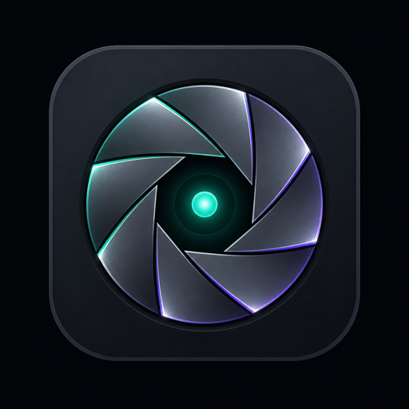

# 📚 Documentation

  

  <b>Senti</b> — What Am I Looking At? 
  Copyright (c) 2026 Arshia Keshvari · MIT License

| | Guide | Start here if you want to… |
| :---: | --- | --- |
| 🏗️ | [Architecture](architecture.md) | Understand the fast/slow loops, threads, and packages |
| 🖱️ | [Usage](usage.md) | Use the window, Ask box, Focus, OCR, TTS, and voice |
| ⚙️ | [Configuration](configuration.md) | Tune `.env` for camera, YOLO, VLM, OCR, speech |
| 🩺 | [Troubleshooting](troubleshooting.md) | Fix a black camera, Qt plugins, Ollama, or Whisper |

Product overview, stack badges, and quick start live in the root [README](../README.md).
