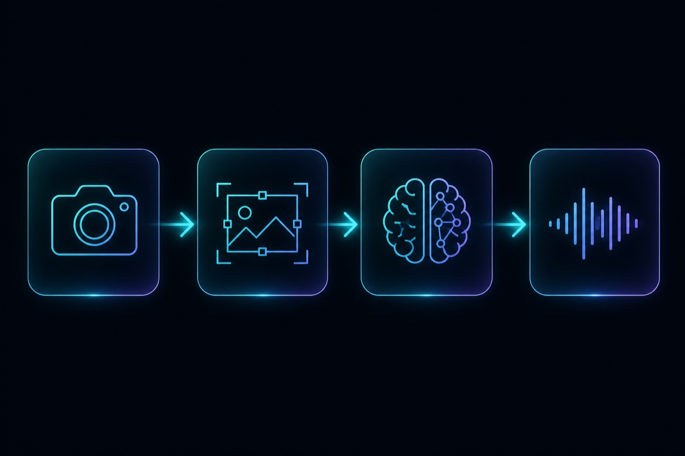

# 🏗️ Architecture

<p align="center">
  
</p>

Copyright (c) 2026 Arshia Keshvari. Licensed under the MIT License.

Senti is a desktop macOS app with two processing loops, several Qt worker threads, and an in-memory scene model. This document describes how those pieces fit together.

## 🎯 Design goals

- **Local-first.** Camera frames never leave the machine. Detection, OCR, speech, and the vision-language model run on-device.
- **Keep the UI live.** YOLO and camera capture must not block the Qt event loop. Heavy work runs on `QThread` workers.
- **Spend VLM time only when it matters.** Automatic analysis waits for a stable scene and a high-quality frame, then respects a cooldown.
- **Answer cheaply when possible.** Simple questions reuse scene memory instead of calling the VLM again.

## 🧱 Runtime stack

| Layer | Role | Technology |
| --- | --- | --- |
| UI | Native window, overlays, status, shortcuts | PySide6 (Fusion style) |
| Capture | Live camera frames | Qt Multimedia / AVFoundation |
| Fast loop | Detect, track, notice scene change | Ultralytics YOLO26 on `mps`/`cpu`, or yolo-mlx on Metal |
| Slow loop | Describe, read, answer | Ollama VLM + optional EasyOCR |
| Speech out | Read answers aloud | Qt TextToSpeech or macOS `say` |
| Speech in | Push-to-talk questions | `sounddevice` + faster-whisper |
| Config | Typed settings from `.env` | `python-dotenv` + `AppConfig` |

## 🧵 Process and threads

`python -m app` loads Qt plugin paths first (`app/qt_bootstrap.py`), then `app.main.main()`:

1. Load and validate `AppConfig`.
2. Request camera permission (and microphone permission when voice is enabled).
3. Start workers and show `MainWindow`.

```text
Main (Qt UI thread)
 ├── CameraCapture          Qt camera + video sink → bounded frame buffer
 ├── DetectionThread        YOLO26 + tracking + ScenePerceptionEngine
 ├── VlmThread              Ollama vision model + VlmScheduler
 ├── OcrThread              EasyOCR (optional)
 ├── VoiceThread            recorder + Whisper (optional)
 └── SpeechController       Qt TTS / macOS say (optional, UI-adjacent)
```

Workers talk to the window with Qt signals. The UI never runs YOLO or VLM inference on the main thread.

## ⚡ Fast loop

Target: **15–30 FPS** on Apple Silicon.

```text
QVideoSink frame
    → CameraFrame (numpy BGR + id + timestamp)
    → BoundedFrameBuffer (drops oldest when full)
    → DetectionThread (always the latest frame, never a backlog)
        → create_detector() (Ultralytics YOLO26 or yolo-mlx)
        → detect / track (ByteTrack / BoT-SORT when TRACKING_ENABLED)
        → ScenePerceptionEngine.update
            → SceneChangeDetector
            → SceneStabilityMonitor
            → FrameSelector (rolling quality buffer)
        → overlays + scene state to MainWindow
```

`DetectionThread` skips frames that are already older than the newest buffered id so the detector never chases a queue.

### Scene states

| State | Meaning |
| --- | --- |
| `INITIALIZING` / `CAMERA_READY` | Startup |
| `WATCHING` | Live preview, no meaningful change |
| `SCENE_CHANGED` | Visual, object, or spatial signal crossed the threshold |
| `WAITING_FOR_STABILITY` | Change detected; waiting for N stable frames |
| `READY` | Scene is stable; best frame is available for the slow loop |
| `ERROR` | Capture or model failure |

Scene change is **not** YOLO-only. `SceneChangeDetector` combines:

- visual difference on downscaled grayscale frames
- objects appearing or disappearing (track IDs and class names)
- spatial movement of existing tracks

A short debounce avoids flickering between `WATCHING` and `SCENE_CHANGED`.

### Best-frame selection

When the scene becomes `READY`, `FrameSelector` ranks recent frames on:

- sharpness (Laplacian variance)
- stability (low motion)
- object size and centering
- detection confidence
- lighting (not too dark / blown out)

That selected frame is what the VLM and OCR see, not a random live frame.

## 🌙 Slow loop

Triggered by:

- automatic analysis when `VLM_AUTO_ANALYZE=true` and the scene reaches `READY`
- the **Analyze** button (manual, bypasses cooldown)
- an **Ask** question that the router sends to the VLM
- an OCR read (`read this`, or auto-OCR on `READY`)

`VlmScheduler` rejects requests that are busy, too soon after the last run, stale, or duplicates of the last analyzed frame. Manual **Analyze** still cannot pile up while a run is in flight.

The Ollama client JPEG-encodes the frame (resized if wide), posts it to `VLM_BASE_URL`, and returns text plus timing. Object-focused questions can crop the target box with padding (`OBJECT_CROP_ENABLED`) so the model sees the thing you meant.

### Question routing

`QuestionRouter` decides how to answer before spending a VLM call:

| Route | Example | Behavior |
| --- | --- | --- |
| `CONTEXT_ONLY` | “what objects do you see?” | Answer from current detections / description |
| `OCR_READ` | “read this” | Run or reuse OCR |
| `VLM_CACHED_FRAME` | short follow-up while context is fresh | Reuse last analyzed frame |
| `VLM_FRESH_FRAME` | stale context, or “what is this?” after motion | New capture + VLM |
| `NO_SCENE` | asked before anything was seen | Ask the user to wait for `READY` |

`SceneContextManager` keeps the current objects, description, OCR lines, conversation turns, and the last analyzed frame in memory only.

## 🔌 Optional pipelines

### OCR

`OcrThread` runs EasyOCR off the UI thread. Results are stored on `CurrentScene` and injected into VLM prompts as extra context. Languages and confidence come from `.env`.

### TTS

`SpeechController` prefers Qt TextToSpeech. Qt exposes only a subset of macOS voices; with `TTS_RUNTIME=auto`, an unknown voice name (for example Tessa) falls back to `/usr/bin/say`. Speak commands (`say that`, `read aloud`) replay the last assistant text.

### Voice input

`VoiceThread` records from the default input, then transcribes with faster-whisper. The transcript is fed into the same Ask pipeline as typed text. **Esc** cancels recording. The Whisper model loads on first use so app startup stays fast.

## 📦 Package map

| Package | Responsibility |
| --- | --- |
| `app.config` | Load `.env`, validate types and ranges, logging |
| `app.qt_bootstrap` | `QT_PLUGIN_PATH`, `QT_INFO_PLIST` before any Qt import |
| `app.camera` | Capture session, metrics, bounded buffer |
| `app.detection` | Detector protocol, Ultralytics or yolo-mlx, detection worker |
| `app.tracking` | Track IDs, new/lost objects |
| `app.perception` | Change, stability, frame scoring, assistant state |
| `app.vision` | VLM interface, Ollama backend, scheduler, crops |
| `app.scene` | Current scene + conversation router |
| `app.ocr` | OCR types, EasyOCR, worker |
| `app.speech` | TTS types, Qt + `say` backends |
| `app.voice` | Recorder, Whisper, worker |
| `app.ui` | Main window, overlays, status helpers |
| `app.main` | Permissions, worker lifecycle |

## 🔐 Data that never hits disk

- Live `CameraFrame.data` arrays
- Selection-buffer candidates
- Last analyzed frame used for follow-ups
- Microphone PCM during a voice capture

YOLO weights live in `models/`. EasyOCR, Whisper, and Ollama models are stored in those libraries’ own caches. None of that is part of the camera frame pipeline.

## 🍎 Apple Silicon notes

`YOLO_RUNTIME=auto` with `YOLO_DEVICE=auto` uses Ultralytics YOLO26 on PyTorch **MPS** when available. Set `YOLO_RUNTIME=mlx` or `YOLO_DEVICE=mlx` for [yolo-mlx](https://github.com/thewebAI/yolo-mlx) (native Metal; `pip install "yolo-mlx[tracking,convert]"`). That path uses `yolo26mlx.YOLO`, official `.pt` → `.npz` conversion with `--verify`, and `model.track(..., persist=True)` for IDs. EasyOCR has no MPS path and will log that it is using CPU; that is expected.
